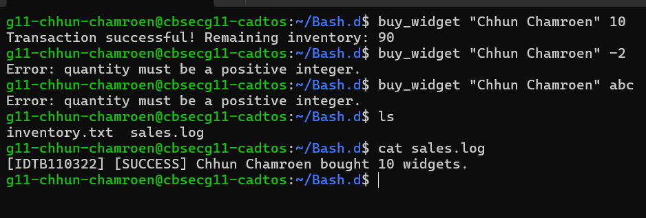
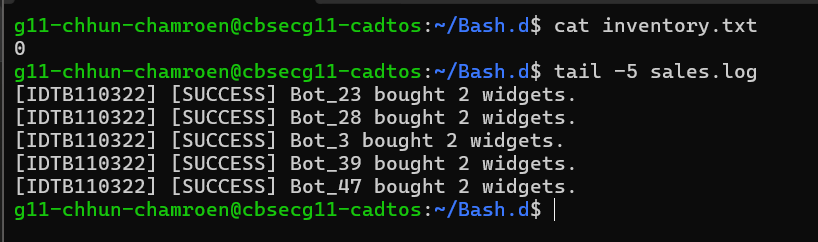
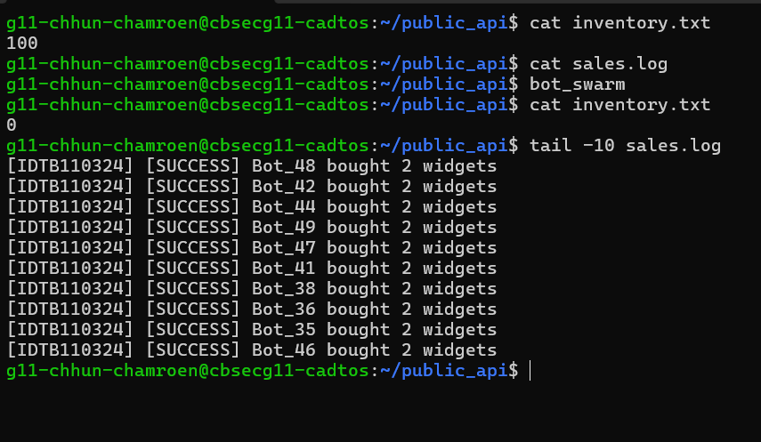
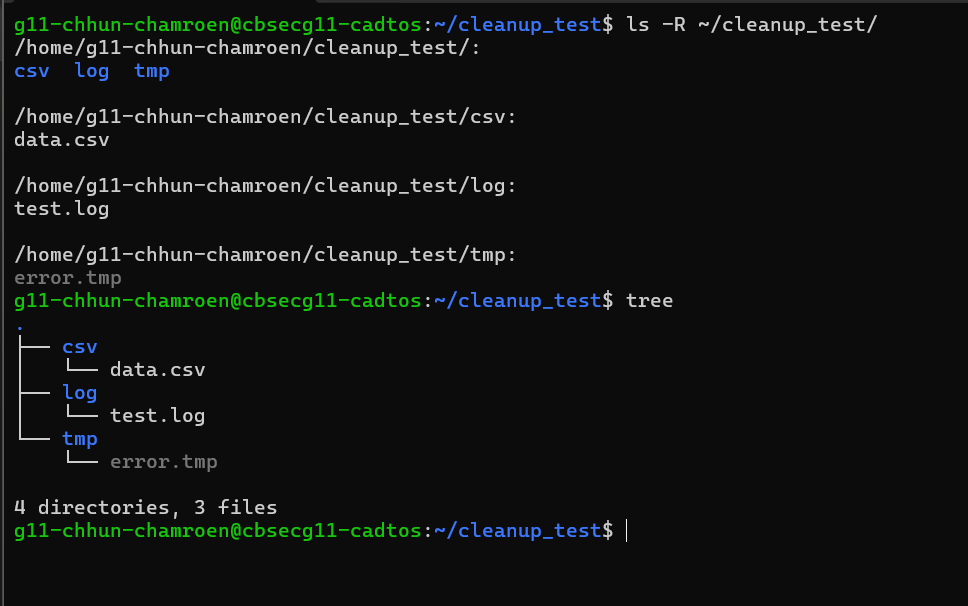
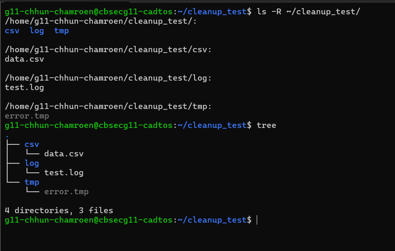

# OS Lab Quantum Widget Report
**Name:** Chhun Chamroen
**Student ID:** IDTB110322
**Repository:** os-lab-quantum-IDTB110322

-----------------------------------------------------

## Level 2 — Audit Trails
### Observation Checkpoint 1
 
----------------------------------------------

## Level 3 — The Exploit (TOC-TOU)
### Results from 5 runs
Run 1: 72
Run 2: 76
Run 3: 84
Run 4: 68
Run 5: 68

### Explanation
The inventory value differs on every run because the OS process
scheduler decides when each of the 50 bots gets CPU time, and
that order is unpredictable every time. When two bots read
inventory.txt at the same moment before either writes back,
one bot result silently overwrites the other causing some
purchases to be lost. This is the classic TOC-TOU race condition.

-----------------------------------

## Level 4 — The Patch (Mutex)
### Observation Checkpoint 3
 
-----------------------------------

## Level 5 — Red Team vs Blue Team
### Observation Checkpoint 4
 
--------------------------------------------------

## Level 6 — Secure Drop Zone
### Observation Checkpoint 5

-----------------------------------------------------------------

## Level 7 — Forensic Cleanup
### Observation Checkpoint 7

